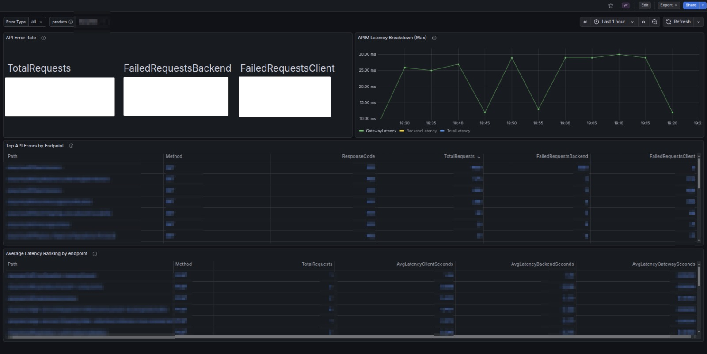

# 
Decidi me aventurar um pouco com Grafana usando datasource do Azure Analytics.

A última vez que tinha mexido com observabilidade foi quando o Mozilla Hubs desvinculou o marketplace da AWS e precisávamos migrar a arquitetura para Azure (AKS). Nesse período, trabalhei com observabilidade de recursos e métricas usando node exporter.

Dessa vez, nas últimas semanas, decidi facilitar um pouco a vida dos desenvolvedores. Criei um dashboard focado em troubleshooting de API no ambiente de produção, para tornar mais rápido identificar se o gargalo está na própria API ou no nosso Gateway.

Nesse dashboard, apliquei o conceito de RED, que foca em três pilares:

- Rate (Taxa): número de requisições por segundo (RPS) que o serviço recebe

- Errors (Erros): número de requisições com falha (ex: HTTP 500)

- Duration (Duração): tempo de resposta das requisições (latência, geralmente em percentis)

Mas na prática, o que isso quer dizer?

No dashboard, eu separei dois tipos principais de erro:

- 4xx (cliente)
- 5xx (servidor)

A partir disso, organizei as visualizações:

- Primeira visualização:
Total de requisições no backend do produto, total de erros 4xx (cliente) e total de erros 5xx (backend)

- Segunda visualização:
 Filtro verde representa picos no Gateway
 Filtro amarelo representa picos no backend
 Filtro azul mostra o total no APIM

- Terceira visualização:
 Top APIs com maior número de erros, filtradas por endpoint, tipo de erro e método HTTP mais retornado

- Quarta visualização:
 Top endpoints com maior latência percebida pelo cliente, com filtro baseado em erro (4xx ou 5xx)

Durante esse processo, comecei a enxergar observabilidade mais pela ótica/experiência do desenvolvedor e do usuário final, e não só como um SRE técnico.

Isso me ajudou a quebrar um bloqueio com observabilidade e, sinceramente, fez com que eu deixasse de ver essa área como algo “complexo demais” ou distante.

